# Preparing for the Certified Kubernetes Application Developer (CKAD) Exam Using Amazon EKS

## Motivation and Background
While I've used Kubernetes professionally in a few capacities (particularly in customer engagements while working at AWS), I wanted to cement my knowledge and increase my mastery with a systematic approach. I decided to prepare for the Certified Kubernetes Application Developer (CKAD) exam. I've taken and passed more than a dozen technology certification exams spanning AWS, Azure, HashiCorp, and more. This exam is unique in several ways. Namely, it's all hands-on in a lab environment. Azure exams often have a coding, configuration, or CLI command component, but even these are typically multiple-choice questions. The CKAD presents you with a virtual desktop and several Kubernetes clusters, making you tackle 15-20 tasks with a strict two-hour time limit. I put together this repository and post for a few reasons:

- I wanted to document all of my hands-on preparation for when I have to recertify in two years
- I wanted to share my knowledge with others and offer a supplemental guide to a CKAD course
- Since the CKAD exam focuses on Kubernetes from a cloud-agnostic perspective, I wanted to fill in the gaps in my own knowledge of running Kubernetes in the AWS ecosystem (e.g., Karpenter, Container Insights, etc.)
- Many courses and guides leverage Microk8s or minikube to run Kubernetes locally, but I wanted to focus on cloud-based infrastructure, especially for things like EBS volumes created via PVCs, ELBs created via a Service, etc.

In summary, this material focuses on hands-on exercises for preparing for the exam and other tools in the cloud-agnostic and AWS ecosystems.

## Preparing for the Exam
While two hours may sound like plenty of time, you'll need to work quickly to complete the exam. With an average of six to eight minutes per exercise (each is **not** timed individually), ensuring you can work efficiently and ergonomically is paramount. The following items were incredibly useful for me:
- Running through a practice exam to get a feel for the CKAD structure
- Proficiency with [Vim motions](https://vimdoc.sourceforge.net/htmldoc/motion.html) (since most of the exam takes place in a terminal) to efficiently edit code
- Generating YAML manifests via the command line for new resources instead of copying and pasting from documentation (e.g., `kubectl create namespace namespace-one -o yaml --dry-run=client`)
- Generating YAML manifests for existing resources that do not have one (e.g., `kubectl get namespace namespace-one -o yaml > namespace.yaml`)
- Leveraging the `explain` command instead of looking up resource properties in the web documentation (e.g., `kubectl explain pod.spec`)
- Memorizing the syntax for running commands in a container (e.g., `kubectl exec -it pod-one -- /bin/sh`) and for quickly creating a new Pod to run commands from (e.g., `kubectl run busybox-shell --image=busybox --rm -it --restart=Never -- sh`)
- Refreshing knowledge of Docker commands like exporting an image (i.e., `docker save image:tag --output image.tar`)

## Materials and Getting Started 
All code shown here resides in [this GitHub repository](https://github.com/scottenriquez/ckad-exam-prep-using-amazon-eks). In addition to this content, I highly recommend the following:
- The [CKAD courses on Pluralsight](https://www.pluralsight.com/paths/certified-kubernetes-application-developer-ckad-2023) for classroom learning 
- [Killer Shell](https://killer.sh/pricing) is key for practice exams
- [This GitHub repository](https://github.com/dgkanatsios/CKAD-exercises/blob/main/README.md) contains many useful CLI commands

My preferred approach was to work through the Pluralsight course first. After reviewing the classroom material, I designed and implemented the examples below. If you have foundational Kubernetes knowledge, skip to the most useful exercises. Each one is designed to be a standalone experience.

## 00: eksctl Configuration
eksctl is a powerful CLI tool that quickly spins up and tears down Kubernetes clusters via Amazon EKS. Nearly all of the exercises below start by leveraging the tool to create a cluster:

```shell title='00-eksctl-configuration/create-cluster.sh'
# before running these commands, first authenticate with AWS (e.g., aws configure sso)
eksctl create cluster -f cluster.yaml
# if connecting to an existing cluster
eksctl utils write-kubeconfig --cluster=learning-kubernetes
```

The default cluster configuration uses a two-node cluster of `t3.medium` instances to keep hourly costs as low as possible. At the time of writing this blog post, the exam tests on Kubernetes version 1.30.

```yaml title='00-eksctl-configuration/culster.yaml'
apiVersion: eksctl.io/v1alpha5
kind: ClusterConfig

metadata:
  name: learning-kubernetes
  region: us-west-2 
  version: "1.30"

nodeGroups:
  - name: node-group-1 
    instanceType: t3.medium 
    desiredCapacity: 2 
    minSize: 2
    maxSize: 2
```

This cluster can be transient for learning purposes. To keep costs low, be sure to run the `destroy-cluster.sh` script to delete the cluster when not in use. I also recommend configuring an [AWS Budget](https://aws.amazon.com/aws-cost-management/aws-budgets/) as an extra measure of cost governance.

```shell title='00-eksctl-configuration/destroy-cluster.sh'
eksctl delete cluster --config-file=cluster.yaml --disable-nodegroup-eviction
```

## 01: First Deployment with Nginx (CKAD Topic)
With the cluster created, we can now make our first [Deployment](https://kubernetes.io/docs/concepts/workloads/controllers/deployment/). We'll start by creating a web server with three replicas using the latest Nginx image:

```yaml title='01-first-deployment-with-nginx/deployment.yaml'
apiVersion: apps/v1
kind: Deployment
metadata:
  name: nginx-deployment
spec:
  replicas: 3
  selector:
    matchLabels:
      app: nginx
  template:
    metadata:
      labels:
        app: nginx
    spec:
      containers:
      - name: nginx-container
        image: nginx:latest
        ports:
        - containerPort: 80
```

The following commands leverage the manifest to create three [Pods](https://kubernetes.io/docs/concepts/workloads/pods/) and inspect them:
```shell title = '01-first-deployment-with-nginx/commands.sh'
# assumes cluster created from 00-eksctl-configuration first
kubectl apply -f ./ 
# returns three pods (e.g., nginx-deployment-5449cb55b-jfgnc)
kubectl get pods -o wide
# clean up
kubectl delete -f ./ 
```

## 02: Pod Communication over IP (CKAD Topic)
The Deployment in this example is identical to the previous: a web server with three replicas. Use the following commands to explore how IP addressing works for Pods:

```shell title = '02-pod-communication-over-ip/commands.sh'
# assumes cluster created from 00-eksctl-configuration first
kubectl apply -f ./
# 192.168.51.32 is one of my pod's IP address, but yours will be different
# when the pod is replaced, this IP address changes
kubectl get pods -o wide
# creates a pod with the BusyBox image
# entering BusyBox container shell to communicate with pods in the cluster
kubectl run -it --rm --restart=Never busybox --image=busybox sh
# replace the IP address as needed
wget 192.168.51.32
# displys the nginx homepage code
cat index.html
# returning to default shell and deletes the BusyBox pod
exit
# clean up
kubectl delete -f ./ 
```

## 03: First Service (CKAD Topic)
Since each Pod has a separate IP address that can change, we can use a [Service](https://kubernetes.io/docs/concepts/services-networking/service/) to keep track of the Pod's IP addresses on our behalf. This abstraction allows us to group Pods via a [selector](https://kubernetes.io/docs/concepts/overview/working-with-objects/labels/#label-selectors) and reference them via a single Service. In the Service manifest and leveraging the same Deployment as before, we specify how to select which Pods to target, what port to expose, and the type of Service:

```yaml title='03-first-service/service.yaml'
apiVersion: v1
kind: Service
metadata:
  name: nginx-service
spec:
  selector:
    name: nginx
  ports:
    - protocol: TCP
      port: 80
      targetPort: 80
      # nodePort is used for external access
  # ClusterIP services are only accessible within the cluster
  # NodePort services are a way to expose ClusterIP services externally without using a cloud provider's load balancer
  # LoadBalancer is covered in the next section
  type: ClusterIP
```

Using the Service, we have a single interface to the three `nginx` replicas. We can also use the Service name instead of its IP address.

```shell title='03-first-service'
# assumes cluster created from 00-eksctl-configuration first
kubectl apply -f ./
# 10.100.120.203 is the service IP address
kubectl describe service nginx-service
# entering BusyBox container shell
kubectl run -it --rm --restart=Never busybox --image=busybox sh
# can also use the IP address instead
wget nginx-service
cat index.html
# returning to default shell
exit
# clean up
kubectl delete -f ./
```

## 04: Elastic Load Balancers for Kubernetes Service (CKAD Topic)
A significant benefit of Kubernetes is that it can create and manage resources in AWS on our behalf. Using the [AWS Load Balancer Controller](https://kubernetes-sigs.github.io/aws-load-balancer-controller/v2.2/), we can specify [annotations](https://kubernetes-sigs.github.io/aws-load-balancer-controller/v2.2/guide/service/annotations/) to create a Service of type LoadBalancer that leverages an Elastic Load Balancer. Using the same Deployment from the past two sections, this manifest illustrates how to leverage a Network Load Balancer for the Service:

```yaml title='04-load-balancer/load-balancer.yaml'
apiVersion: v1
kind: Service
metadata:
  name: nginx-load-balancer
  annotations:
    service.beta.kubernetes.io/aws-load-balancer-internal: "true"
    # by default, a Classic Load Balancer is created
    # https://docs.aws.amazon.com/elasticloadbalancing/latest/classic/introduction.html
    # this annotation creates a Network Load Balancer
    service.beta.kubernetes.io/aws-load-balancer-type: "nlb"
spec:
  selector:
    name: nginx
  ports:
    - protocol: TCP
      port: 80
      targetPort: 80
  type: LoadBalancer
status:
  loadBalancer:
    ingress:
    - ip: "192.0.2.127" 
```

The following commands deploy the LoadBalancer Service:
```shell title='04-load-balancer/commands.sh'
# assumes cluster created from 00-eksctl-configuration first
kubectl apply -f ./ 
# entering BusyBox container shell
kubectl run -it --rm --restart=Never busybox --image=busybox sh
wget nginx-load-balancer
cat index.html
# returning to default shell
exit
# clean up
# this command ensures that the load balancer is deleted
# be sure to run before destroying the cluster
kubectl delete -f ./
```

## 05: Ingress (CKAD Topic)
Services of type ClusterIP only support internal cluster networking. The NodePort configuration allows for external communication by exposing the same port on every node (i.e., EC2 instances in our case). However, this introduces a different challenge because the consumer must know the nodes' IP addresses (and nodes are often transient). The LoadBalancer configuration has a 1:1 relationship with the Service. If you have numerous Services, the cost of load balancers may not be feasible. [Ingress](https://kubernetes.io/docs/concepts/services-networking/ingress/) alleviates some of these challenges by providing a single external interface over HTTP or HTTPS with support for path-based routing. Leveraging the Nginx example one last time, we can create an Ingress that exposes a Service with the NodePort configuration via an Application Load Balancer.

```yaml title='05-ingress/ingress.yaml'
apiVersion: networking.k8s.io/v1
kind: Ingress  
metadata:
  name: ingress
  annotations:
    kubernetes.io/ingress.class: alb
    alb.ingress.kubernetes.io/scheme: internet-facing
spec:
  rules:
    - http:
        paths:
          - path: /
            pathType: Prefix
            backend:
              service:
                name: nginx-service
                port: 
                  number: 80
```

The following commands install the AWS Load Balancer Controller, configure required IAM permissions, and deploy the Ingress. Be sure to set the `$AWS_ACCOUNT_ID` environment variable first.

```shell title='05-ingress/commands.sh'
# assumes cluster created from 00-eksctl-configuration first
# install AWS Load Balancer Controller
# https://docs.aws.amazon.com/eks/latest/userguide/lbc-manifest.html
curl -O https://raw.githubusercontent.com/kubernetes-sigs/aws-load-balancer-controller/v2.7.2/docs/install/iam_policy.json
aws iam create-policy \
    --policy-name AWSLoadBalancerControllerIAMPolicy \
    --policy-document file://iam_policy.json
rm iam_policy.json
eksctl utils associate-iam-oidc-provider --region=us-west-2 --cluster=learning-kubernetes --approve
eksctl create iamserviceaccount \
  --cluster=learning-kubernetes \
  --namespace=kube-system \
  --name=aws-load-balancer-controller \
  --role-name AmazonEKSLoadBalancerControllerRole \
  --attach-policy-arn=arn:aws:iam::$AWS_ACCOUNT_ID:policy/AWSLoadBalancerControllerIAMPolicy \
  --approve
kubectl apply \
    --validate=false \
    -f https://github.com/jetstack/cert-manager/releases/download/v1.13.5/cert-manager.yaml
curl -Lo v2_7_2_full.yaml https://github.com/kubernetes-sigs/aws-load-balancer-controller/releases/download/v2.7.2/v2_7_2_full.yaml
sed -i.bak -e '596,604d' ./v2_7_2_full.yaml
sed -i.bak -e 's|your-cluster-name|learning-kubernetes|' ./v2_7_2_full.yaml
kubectl apply -f v2_7_2_full.yaml
rm v2_7_2_full.yaml* 
kubectl get deployment -n kube-system aws-load-balancer-controller
# apply maniftests
kubectl apply -f ./ 
# gets address (e.g, http://k8s-default-ingress-08daebdfec-204015293.us-west-2.elb.amazonaws.com/) that can be opened in a web browser
kubectl describe ingress
# clean up
kubectl delete -f ./
```

## 06: Jobs and CronJobs (CKAD Topic)
[Jobs](https://kubernetes.io/docs/concepts/workloads/controllers/job/) are a powerful mechanism that reliably ensures that Pods are completed successfully. [CronJobs](https://kubernetes.io/docs/concepts/workloads/controllers/cron-jobs/) extend this functionality by supporting a recurring schedule.

```yaml title='06-jobs-and-cronjobs/job.yaml'
apiVersion: batch/v1
kind: Job
metadata:
  name: pi
spec:
  template:
    spec:
      containers:
      - name: pi
        image: perl:5.34.0
        command: ["perl",  "-Mbignum=bpi", "-wle", "print bpi(2000)"]
      restartPolicy: Never
  backoffLimit: 4
```

```yaml title='06-jobs-and-cronjobs/cronjob.yaml'
apiVersion: batch/v1
kind: CronJob
metadata:
  name: hello
spec:
  # runs every minute
  schedule: "* * * * *"
  jobTemplate:
    spec:
      template:
        spec:
          containers:
          - name: hello
            image: busybox:1.28
            imagePullPolicy: IfNotPresent
            command:
            - /bin/sh
            - -c
            - date; echo Hello from the Kubernetes cluster
          restartPolicy: OnFailure
```

## 07: Metrics Server and Pod Autoscaling (CKAD Topic)
[Metrics Server](https://github.com/kubernetes-sigs/metrics-server) provides container-level resource metrics for autoscaling within Kubernetes. It is not installed by default and is meant only for autoscaling purposes. There are [other options](https://github.com/kubernetes-sigs/metrics-server?tab=readme-ov-file#use-cases), such as Container Insights, Prometheus, and Grafana, for more accurate resource usage metrics (all covered later in this post). With Metrics Server installed, a [HorizontalPodAutoscaler](https://kubernetes.io/docs/tasks/run-application/horizontal-pod-autoscale/) resource can be configured with values such as target metric, minimum replicas, maximum replicas, etc.

```yaml title='07-metrics-server-and-pod-autoscaling/horizontal-pod-autoscaler.yaml'
apiVersion: autoscaling/v2
kind: HorizontalPodAutoscaler
metadata:
  name: php-apache
spec:
  scaleTargetRef:
    apiVersion: apps/v1
    kind: Deployment
    name: php-apache
  minReplicas: 1
  maxReplicas: 10
  metrics:
  - type: Resource
    resource:
      name: cpu
      target:
        type: Utilization
        averageUtilization: 50
status:
  observedGeneration: 1
  currentReplicas: 1
  desiredReplicas: 1
  currentMetrics:
  - type: Resource
    resource:
      name: cpu
      current:
        averageUtilization: 0
        averageValue: 0
```

HorizontalPodAutoscalers create and destroy Pods based on metric usage. On the other hand, [vertical autoscaling](https://github.com/kubernetes/autoscaler/tree/master/vertical-pod-autoscaler) rightsizes the resource limits (covered in the next section) for Pods.

## 08: Resource Management (CKAD Topic)
When creating a Pod, you can optionally specify an estimate for the number of resources a container needs (e.g., CPU and RAM). This baseline estimate should be specified in the `requests` parameter. The `limits` parameter specifies the threshold for which a container should be terminated to prevent starvation of other processes. Limits also help with cluster capacity planning (e.g., EKS node groups). Below is the Nginx Deployment from earlier with resource management applied:

```yaml title='08-resource-management/deployment.yaml'
apiVersion: apps/v1
kind: Deployment
metadata:
  name: nginx-deployment
spec:
  replicas: 3
  selector:
    matchLabels:
      name: nginx
  template:
    metadata:
      labels:
        name: nginx
    spec:
      containers:
      - name: nginx-container
        image: nginx:latest
        ports:
        - containerPort: 80
        resources:
          # estimated resources for container to run optimally
          requests:
            cpu: 100m
            memory: 128Mi
          # kills the container if threshold is crossed
          limits:
            cpu: 200m
            memory: 256Mi
```

## 09: Karpenter
In the previous two sections, we covered how additional Pods are created (i.e., horizontal scaling) and how resources (e.g., CPU and RAM) are requested and limited in Kubernetes. The next topic is managing the underlying compute when additional infrastructure is required. There are two primary options for scaling compute using EKS on EC2: Cluster Autoscaler and [Karpenter](https://karpenter.sh/). On AWS, Cluster Autoscaler leverages EC2 Auto Scaling Groups (ASGs) to manage node groups. Cluster Autoscaler typically runs as a Deployment in the cluster. Karpenter does not leverage ASGs, allowing for the ability to select from a wide array of instance types that match the exact requirements of the additional containers. Karpenter also allows for easy adoption of [Spot](https://aws.amazon.com/ec2/spot/) for further cost savings on top of better matching the workload to compute resources. The cluster defined in `00-eksctl-configuration` uses an unmanaged node group and does not leverage Cluster Autoscaler or Karpenter. To demonstrate how to leverage Karpenter, we'll need a different cluster configuration file. We can dynamically generate it like so:

```shell title='09-karpenter/commands.sh'
# set environment variables
export KARPENTER_NAMESPACE=karpenter
export KARPENTER_VERSION=v0.32.10
export K8S_VERSION=1.28
export AWS_PARTITION="aws"
export CLUSTER_NAME="${USER}-karpenter-demo"
export AWS_DEFAULT_REGION="us-west-2"
export AWS_ACCOUNT_ID="$(aws sts get-caller-identity --query Account --output text)"
export ARM_AMI_ID="$(aws ssm get-parameter --name /aws/service/eks/optimized-ami/${K8S_VERSION}/amazon-linux-2-arm64/recommended/image_id --query Parameter.Value --output text)"
export AMD_AMI_ID="$(aws ssm get-parameter --name /aws/service/eks/optimized-ami/${K8S_VERSION}/amazon-linux-2/recommended/image_id --query Parameter.Value --output text)"
export GPU_AMI_ID="$(aws ssm get-parameter --name /aws/service/eks/optimized-ami/${K8S_VERSION}/amazon-linux-2-gpu/recommended/image_id --query Parameter.Value --output text)"
# deploy resources to support Karpenter
aws cloudformation deploy \
  --stack-name "Karpenter-${CLUSTER_NAME}" \
  --template-file karpenter-support-resources-cfn.yaml \
  --capabilities CAPABILITY_NAMED_IAM \
  --parameter-overrides "ClusterName=${CLUSTER_NAME}"
# generate cluster file and deploy
<<EOF > cluster.yaml
---
apiVersion: eksctl.io/v1alpha5
kind: ClusterConfig
metadata:
  name: ${CLUSTER_NAME}
  region: ${AWS_DEFAULT_REGION}
  version: "${K8S_VERSION}"
  tags:
    karpenter.sh/discovery: ${CLUSTER_NAME}

iam:
  withOIDC: true
  serviceAccounts:
  - metadata:
      name: karpenter
      namespace: "${KARPENTER_NAMESPACE}"
    roleName: ${CLUSTER_NAME}-karpenter
    attachPolicyARNs:
    - arn:${AWS_PARTITION}:iam::${AWS_ACCOUNT_ID}:policy/KarpenterControllerPolicy-${CLUSTER_NAME}
    roleOnly: true

iamIdentityMappings:
- arn: "arn:${AWS_PARTITION}:iam::${AWS_ACCOUNT_ID}:role/KarpenterNodeRole-${CLUSTER_NAME}"
  username: system:node:{{EC2PrivateDNSName}}
  groups:
  - system:bootstrappers
  - system:nodes

managedNodeGroups:
- instanceType: t3.medium
  amiFamily: AmazonLinux2
  name: ${CLUSTER_NAME}-ng
  desiredCapacity: 2
  minSize: 2
  maxSize: 5
EOF
eksctl create cluster -f cluster.yaml
```

Next, we install Karpenter on the EKS cluster:

```shell title='09-karpenter/commands.sh'
# set additional environment variables
export CLUSTER_ENDPOINT="$(aws eks describe-cluster --name ${CLUSTER_NAME} --query "cluster.endpoint" --output text)"
export KARPENTER_IAM_ROLE_ARN="arn:${AWS_PARTITION}:iam::${AWS_ACCOUNT_ID}:role/${CLUSTER_NAME}-karpenter"
# install Karpenter
helm registry logout public.ecr.aws
helm upgrade --install karpenter oci://public.ecr.aws/karpenter/karpenter --version "${KARPENTER_VERSION}" --namespace "${KARPENTER_NAMESPACE}" --create-namespace \
  --set "serviceAccount.annotations.eks\.amazonaws\.com/role-arn=${KARPENTER_IAM_ROLE_ARN}" \
  --set "settings.clusterName=${CLUSTER_NAME}" \
  --set "settings.interruptionQueue=${CLUSTER_NAME}" \
  --set controller.resources.requests.cpu=1 \
  --set controller.resources.requests.memory=1Gi \
  --set controller.resources.limits.cpu=1 \
  --set controller.resources.limits.memory=1Gi \
  --wait
```

Finally, we create a node pool that specifies what compute our workload can support. In this case, Karpenter can provision EC2 Spot instances from the `c`, `m`, or `r` families from any generation greater than two running Linux on AMD64 architecture.

```shell title='09-karpenter/commands.sh'
# create NodePool
<<EOF > node-pool.yaml
apiVersion: karpenter.sh/v1beta1
kind: NodePool
metadata:
  name: default
spec:
  template:
    spec:
      requirements:
        - key: kubernetes.io/arch
          operator: In
          values: ["amd64"]
        - key: kubernetes.io/os
          operator: In
          values: ["linux"]
        - key: karpenter.sh/capacity-type
          operator: In
          values: ["spot"]
        - key: karpenter.k8s.aws/instance-category
          operator: In
          values: ["c", "m", "r"]
        - key: karpenter.k8s.aws/instance-generation
          operator: Gt
          values: ["2"]
      nodeClassRef:
        apiVersion: karpenter.k8s.aws/v1beta1
        kind: EC2NodeClass
        name: default
  limits:
    cpu: 1000
  disruption:
    consolidationPolicy: WhenUnderutilized
    expireAfter: 720h
---
apiVersion: karpenter.k8s.aws/v1beta1
kind: EC2NodeClass
metadata:
  name: default
spec:
  amiFamily: AL2
  role: "KarpenterNodeRole-${CLUSTER_NAME}"
  subnetSelectorTerms:
    - tags:
        karpenter.sh/discovery: "${CLUSTER_NAME}"
  securityGroupSelectorTerms:
    - tags:
        karpenter.sh/discovery: "${CLUSTER_NAME}"
  amiSelectorTerms:
    - id: "${ARM_AMI_ID}"
    - id: "${AMD_AMI_ID}"
EOF
kubectl apply -f node-pool.yaml
```

With the new EKS cluster deployed and Karpenter installed, we can add new Pods and see new EC2 instances created on our behalf.

```shell title='09-karpenter/commands.sh'
# deploy pods and scale
kubectl apply -f deployment.yaml
kubectl scale deployment inflate --replicas 5
```

In less than a minute after the `inflate` command, a new EC2 instance is created that matches the node pool specifications. In my case, a `c5n.2xlarge` server was deployed.

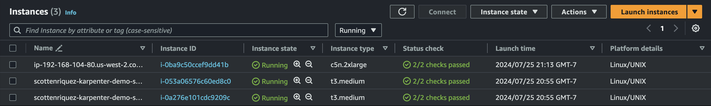

As expected, the node pool leverages Spot instances.

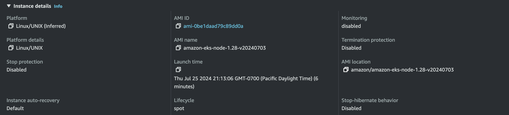

You can monitor the Karpenter logs via the command below. Less than a minute after deleting the Deployment, the `c5n.2xlarge` instance was terminated. Be sure to follow the cleanup steps when done to ensure no resources become orphaned.

```shell title='09-karpenter/commands.sh'
# monitor Karpenter events
kubectl logs -f -n "${KARPENTER_NAMESPACE}" -l app.kubernetes.io/name=karpenter -c controller
# scale down
kubectl delete deployment inflate
# clean up
helm uninstall karpenter --namespace "${KARPENTER_NAMESPACE}"
aws cloudformation delete-stack --stack-name "Karpenter-${CLUSTER_NAME}"
aws ec2 describe-launch-templates --filters Name=tag:karpenter.k8s.aws/cluster,Values=${CLUSTER_NAME} |
    jq -r ".LaunchTemplates[].LaunchTemplateName" |
    xargs -I{} aws ec2 delete-launch-template --launch-template-name {}
eksctl delete cluster --name "${CLUSTER_NAME}"
```

## 10: Persistent Volumes Using EBS (CKAD Topic)
Storage in Kubernetes can be classified as either ephemeral or persistent. Without leveraging [PersistentVolumes](https://kubernetes.io/docs/concepts/storage/persistent-volumes/) (PVs), containers read and write data to the volume attached to the node they run on. Ephemeral storage is temporary and tied to the Pod's lifecycle. If requirements dictate that the storage persists or be shared across Pods, there are some prerequisites before EBS can be leveraged for PVs.

The first step is installing the [AWS EBS Container Storage Interface (CSI) driver](https://docs.aws.amazon.com/eks/latest/userguide/ebs-csi.html). The next step is to define a [StorageClass](https://kubernetes.io/docs/concepts/storage/storage-classes/) (SC) that includes configuration such as volume type (e.g., `gp3`), encryption, etc. The final step is to reference a [PersistentVolumeClaim](https://kubernetes.io/docs/concepts/storage/persistent-volumes/#dynamic) (PVC) when deploying a Pod in order to dynamically provision the EBS volume and attach to the containers.

In practice, this goes as follows:

```shell title='10-persistent-volumes/commands.sh'
# assumes cluster created from 00-eksctl-configuration first
# create an OIDC provider
eksctl utils associate-iam-oidc-provider --cluster learning-kubernetes --approve
# install aws-ebs-csi-driver
eksctl create iamserviceaccount \
    --name ebs-csi-controller-sa \
    --namespace kube-system \
    --cluster learning-kubernetes \
    --role-name AmazonEKS_EBS_CSI_DriverRole \
    --role-only \
    --attach-policy-arn arn:aws:iam::aws:policy/service-role/AmazonEBSCSIDriverPolicy \
    --approve
eksctl create addon --name aws-ebs-csi-driver --cluster learning-kubernetes --service-account-role-arn arn:aws:iam::$AWS_ACCOUNT_ID:role/AmazonEKS_EBS_CSI_DriverRole --force
```

Once completed, the add-on will appear in the AWS Console.

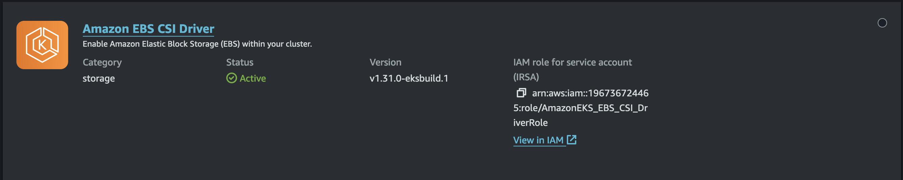

Next, define the StorageClass and PersistentVolumeClaim:

```yaml title='10-persistent-volumes/storage-class.yaml'
apiVersion: storage.k8s.io/v1
kind: StorageClass
metadata:
  name: ebs-sc
provisioner: ebs.csi.aws.com
volumeBindingMode: WaitForFirstConsumer
parameters:
  csi.storage.k8s.io/fstype: xfs
  type: gp3
  encrypted: "true"
allowedTopologies:
  - matchLabelExpressions:
      - key: topology.ebs.csi.aws.com/zone
        values:
          - us-west-2a
          - us-west-2b
          - us-west-2c
```

```yaml title='10-persistent-volumes/persistent-volume-claim.yaml'
apiVersion: v1
kind: PersistentVolumeClaim
metadata:
  name: ebs-claim
spec:
  accessModes:
    - ReadWriteOnce
  storageClassName: ebs-sc
  resources:
    requests:
      storage: 4Gi
```

Finally, attach the PVC to the Pod and deploy:

```yaml title='10-persistent-volumes/persistent-volume-claim.yaml'
apiVersion: v1
kind: Pod
metadata:
  name: app
spec:
  containers:
    - name: app
      image: centos
      command: ["/bin/sh"]
      args: ["-c", "while true; do echo $(date -u) >> /data/out.txt; sleep 5; done"]
      volumeMounts:
        - name: persistent-storage
          mountPath: /data
  volumes:
    - name: persistent-storage
      persistentVolumeClaim:
        claimName: ebs-claim
```

As soon as the Pod is created, a `gp3` volume is provisioned.

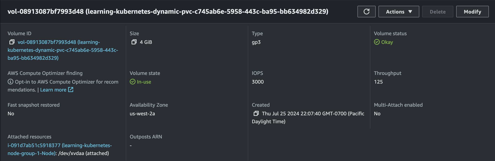

## 11: Prometheus and Grafana
The next several sections focus on observability. [Prometheus](https://prometheus.io/) is an open-source monitoring system commonly leveraged in Kubernetes clusters. As a de facto standard, it's widely used with [Grafana](https://grafana.com/) to provide cluster monitoring. Using Helm we can quickly deploy both of these tools to our cluster.

```shell
# assumes cluster created from 00-eksctl-configuration first
# install Helm on local machine
# https://helm.sh/docs/intro/install/
brew install helm
# install Helm charts
helm repo add prometheus-community https://prometheus-community.github.io/helm-charts
helm repo update
helm install v60-0-1 prometheus-community/kube-prometheus-stack --version 60.0.1
# use http://localhost:9090 to access Prometheus
kubectl port-forward svc/prometheus-operated 9090
# get Grafana password for admin
kubectl get secret v60-0-1-grafana -o jsonpath="{.data.admin-password}" | base64 --decode ; echo
# use http://localhost:3000 to access Grafana
kubectl port-forward svc/v60-0-1-grafana 3000:80
```

Using port forwarding, we can quickly access Prometheus:

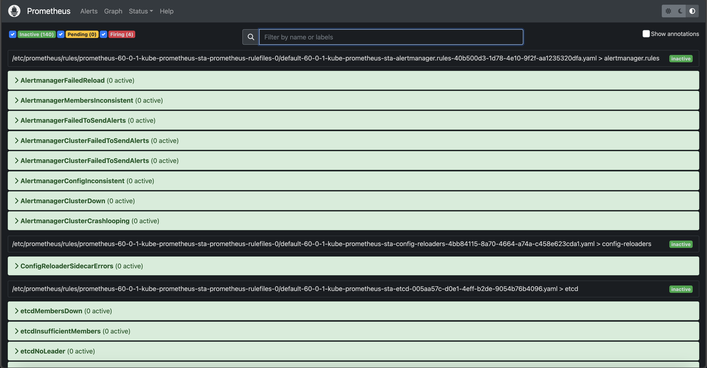

And Grafana:

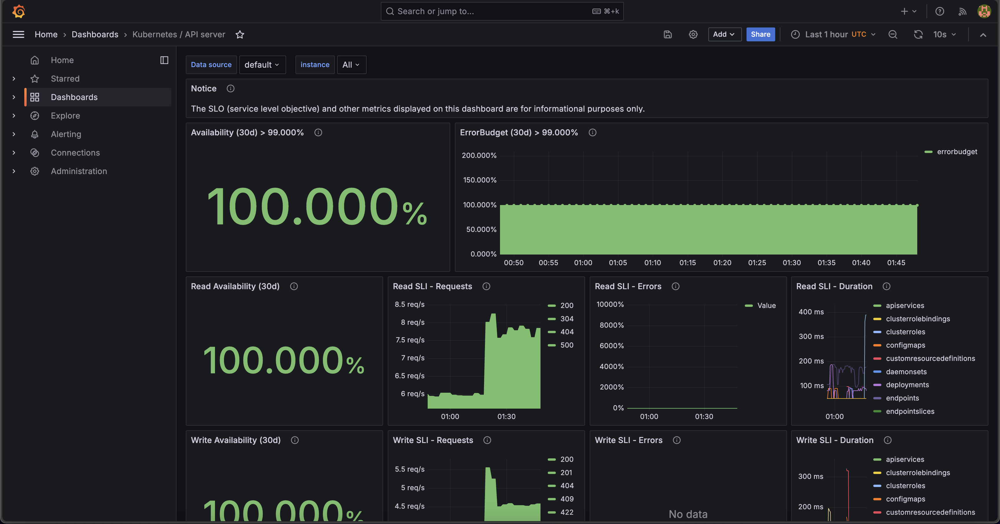

## 12: Container Insights
Prometheus and Grafana are both open-source and cloud-agnostic. AWS has a native infrastructure monitoring offering called [Container Insights](https://docs.aws.amazon.com/AmazonCloudWatch/latest/monitoring/ContainerInsights.html) that integrates cluster data with the AWS Console via CloudWatch with two simple commands:

```shell title='12-container-insights/commands.sh'
# assumes cluster created from 00-eksctl-configuration first
# configure permissions
# change role to the one created by eksctl
aws iam attach-role-policy \
--role-name $EKSCTL_NODEGROUP_ROLE_NAME \
--policy-arn arn:aws:iam::aws:policy/CloudWatchAgentServerPolicy
# wait until add-on is installed and give time for data to propagate
aws eks create-addon --cluster-name learning-kubernetes --addon-name amazon-cloudwatch-observability
```

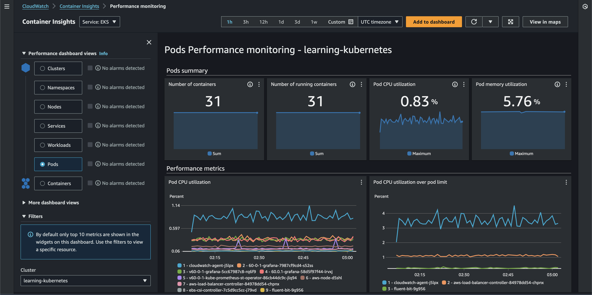

It's worth noting that Container Insights can also [ingest Prometheus metrics](https://docs.aws.amazon.com/AmazonCloudWatch/latest/monitoring/ContainerInsights-Prometheus.html).

## 13: EKS Split Cost Allocation Data in Cost and Usage Reports
The [AWS Cost and Usage Reports](https://docs.aws.amazon.com/cur/latest/userguide/what-is-cur.html) (CUR) are the most comprehensive and detailed billing data available to customers. It offers [a well-defined schema](https://docs.aws.amazon.com/cur/latest/userguide/table-dictionary-cur2.html) that we can use to write [SQL queries against via Athena](https://catalog.workshops.aws/cur-query-library/en-US). CUR data offers resource-level time series data for in-depth AWS cost and usage analysis. In April 2024, AWS released [EKS split cost allocation data for CUR](https://docs.aws.amazon.com/cur/latest/userguide/split-cost-allocation-data.html). Previously, the lowest resource level available was an EC2 instance. This feature adds billing data container-level resources in EKS (e.g., Pods).

Create a new CUR via Data Exports in the Billing and Cost Management Console if required. If you have an existing CUR without split cost allocation data, you can modify the report content configuration to add this.

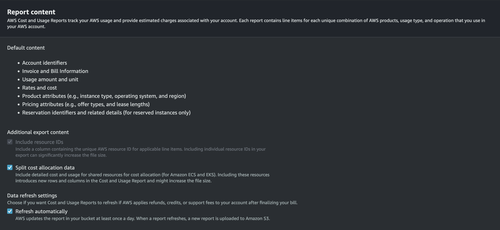

With this configured, we can use the following [SQL query in Athena](https://docs.aws.amazon.com/cur/latest/userguide/cur-query-athena.html) to gather cost and usage data for the EKS cluster resources:

```sql
SELECT 
  DATE_FORMAT(
    DATE_TRUNC(
      'day', "line_item_usage_start_date"
    ), 
    '%Y-%m-%d'
  ) AS "date",
  "line_item_resource_id" AS "resource_id",
  ARBITRARY(CONCAT(
    REPLACE(
      SPLIT_PART(
        "line_item_resource_id", 
        '/', 1
      ), 
      'pod', 
      'cluster'
    ), 
    '/', 
    SPLIT_PART(
      "line_item_resource_id", 
      '/', 2
    )
  )) AS "cluster_arn", 
  ARBITRARY(SPLIT_PART(
    "line_item_resource_id", 
    '/', 2
  )) AS "cluster_name", 
  ARBITRARY("split_line_item_parent_resource_id") AS "node_instance_id", 
  ARBITRARY("resource_tags_aws_eks_node") AS "node_name", 
  ARBITRARY(SPLIT_PART(
    "line_item_resource_id", 
    '/', 3
  )) AS "namespace",
  ARBITRARY("resource_tags_aws_eks_workload_type") AS "controller_kind", 
  ARBITRARY("resource_tags_aws_eks_workload_name") AS "controller_name", 
  ARBITRARY("resource_tags_aws_eks_deployment") AS "deployment",
  ARBITRARY(SPLIT_PART(
    "line_item_resource_id", 
    '/', 4
  )) AS "pod_name", 
  ARBITRARY(SPLIT_PART(
    "line_item_resource_id", 
    '/', 5
  )) AS "pod_uid", 
  SUM(
    CASE WHEN "line_item_usage_type" LIKE '%EKS-EC2-vCPU-Hours' THEN "split_line_item_split_cost" + "split_line_item_unused_cost" ELSE 0.0 END
  ) AS "cpu_cost", 
  SUM(
    CASE WHEN "line_item_usage_type" LIKE '%EKS-EC2-GB-Hours' THEN "split_line_item_split_cost" + "split_line_item_unused_cost" ELSE 0.0 END
  ) AS "ram_cost", 
  SUM(
    "split_line_item_split_cost" + "split_line_item_unused_cost"
  ) AS "total_cost" 
FROM 
  cur
WHERE 
  "line_item_operation" = 'EKSPod-EC2' 
  AND CURRENT_DATE - INTERVAL '7' DAY <= "line_item_usage_start_date" 
GROUP BY 
  1, 
  2
ORDER BY 
  "cluster_arn", 
  "date" DESC
```

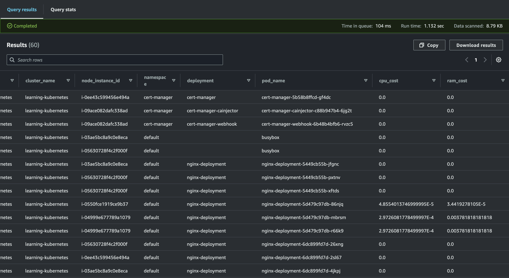

AWS also offers [open-source QuickSight dashboards](https://d1s0yx3p3y3rah.cloudfront.net/anonymous-embed?dashboard=containers-cost-allocation&sheet=default) that provide a visualization of this data.

## 14: ConfigMap (CKAD Topic)
The following two sections focus on configuration management. A [ConfigMap](https://kubernetes.io/docs/concepts/configuration/configmap/) is a Kubernetes construct that stores non-sensitive key-value pairs (e.g., URLs, feature flags, etc.). There are several ways to consume ConfigMaps, but we'll set an environment variable for a container below. First, I created a TypeScript [Cloud Development Kit](https://aws.amazon.com/cdk/) (CDK) application to deploy a [FastAPI](https://fastapi.tiangolo.com/) container to Elastic Container Repository (ECR). The API is simple:

```python title='14-configmap/api-cdk/container/app/main.py'
api = fastapi.FastAPI()
@api.get('/api/config')
def config():
    return {
        'message': os.getenv('CONFIG_MESSAGE', 'Message not set')
    }
```

We publish the container to ECR via CDK:

```typescript title='14-configmap/api-cdk/lib/api-cdk-stack.ts'
import * as cdk from 'aws-cdk-lib';
import { Construct } from 'constructs';
import { DockerImageAsset } from 'aws-cdk-lib/aws-ecr-assets';

export class ApiCdkStack extends cdk.Stack {
  constructor(scope: Construct, id: string, props?: cdk.StackProps) {
    super(scope, id, props);
    const dockerImageAsset = new DockerImageAsset(this, 'MyDockerImage', {
      directory: './container/'
    });
  }
}
```

Next, we define the ConfigMap:

```yaml title='14-configmap/configmap.yaml'
apiVersion: v1
kind: ConfigMap
metadata:
  name: api-configmap
data:
  config-message: "Hello from ConfigMap!"
```

Finally, we reference the ConfigMap in the Deployment:

```yaml title='14-configmap/deployment.yaml'
apiVersion: apps/v1
kind: Deployment
metadata:
  name: config-api-deployment
spec:
  replicas: 1
  selector:
    matchLabels:
      name: config-api
  template:
    metadata:
      labels:
        name: config-api
    spec:
      containers:
        - name: config-api-container
          # deployed via CDK
          # replace with your image
          image: 196736724465.dkr.ecr.us-west-2.amazonaws.com/cdk-hnb659fds-container-assets-196736724465-us-west-2:afbbd8d7b43a7f833eb07c26a13d5344fa7656c136b1e27b545490fa58dad983
          ports:
            - containerPort: 8000
          env:
            - name: CONFIG_MESSAGE
              valueFrom:
                configMapKeyRef:
                  name: api-configmap
                  key: config-message
```

With the API deployed, we can verify that the configuration propagates correctly.

```shell title='14-configmap/commands.sh'
# entering BusyBox container shell
kubectl run -it --rm --restart=Never busybox --image=busybox sh
wget config-api-service:80/api/config
cat config
```

## 15: Secrets (CKAD Topic)
[Secrets](https://kubernetes.io/docs/concepts/configuration/secret/) are very similar to ConfigMaps except that they are intended for sensitive information. Opaque is the default type of Secret for arbitrary user data unless you need to store SSH credentials, TLS certificates, `~/.dockercfg`, etc. For a complete list of types, see the [documentation](https://kubernetes.io/docs/concepts/configuration/secret/#secret-types). Kubernetes Secrets do not encrypt the data on your behalf. That responsibility is on the developer.

```yaml title='15-secrets/secret.yaml'
apiVersion: v1
kind: Secret
metadata:
  name: busybox-password 
type: Opaque
data:
  password: MWYyZDFlMmU2N2Rm
```

## 16: Multi-Container Pods (CKAD Topic)
In the examples so far, Pods and containers had a 1:1 relationship. Two common patterns for multi-container Pods in Kubernetes are [init containers](https://kubernetes.io/docs/concepts/workloads/pods/init-containers/) and [sidecars](https://kubernetes.io/docs/concepts/workloads/pods/sidecar-containers/). To illustrate these patterns, we'll use a PostgreSQL database with a backend that relies on it. Given that the backend container depends on the database, we must ensure that PostgreSQL is available before starting it. To do so, we can use an init container that verifies the ability to connect to the database. All init containers run before the Pod starts. If any init container fails, the Pod fails.

```yaml title='16-multi-container-pods/backend.deployment.yaml'
apiVersion: apps/v1
kind: Deployment
metadata:
  name: backend-with-database
  namespace: default
spec:
  selector:
    matchLabels:
      app: backend
  replicas: 1
  template:
    metadata:
      labels:
        app: backend
    spec:
      initContainers:
        - name: verify-database-online
          image: postgres
          command: [ 'sh', '-c',
            'until pg_isready -h database-service -p 5432; 
                do echo waiting for database; sleep 2; done;' ]
      containers:
        - name: backend
          image: nginx
```

An example of a sidecar container is a GUI called Adminer for the database. The GUI has a lifecycle tightly coupled to the Postgres container (i.e., if we don't need the database anymore, we don't need the GUI). To configure a sidecar, append another container to the Deployment's `spec`:

```yaml title='16-multi-container-pods/database.deployment.yaml'
apiVersion: apps/v1
kind: Deployment
metadata:
  name: postgres-database
  namespace: default
spec:
  selector:
    matchLabels:
      app: database
  replicas: 1
  template:
    metadata:
      labels:
        app: database
    spec:
      containers:
        - name: database
          image: postgres
          envFrom:
            - configMapRef:
                name: database-access
          ports:
            - containerPort: 5432
        - name: database-admin
          image: adminer
          ports:
            - containerPort: 8080
```

With the sidecar in place, we can deploy and leverage the GUI to log into our database.

```shell title='16-multi-container-pods/commands.sh'
# assumes cluster created from 00-eksctl-configuration first
kubectl apply -f database.configmap.yaml
kubectl apply -f backend.deployment.yaml
# check that the primary container is not yet running because the init container has not completed
# STATUS shows as Init:0/1
kubectl get pods
# deploy database and service
kubectl apply -f database.deployment.yaml
kubectl apply -f database.service.yaml
# verify that init container has completed
# get database pod
kubectl get pods
# forward ports
kubectl port-forward pod/postgres-database-697695b774-xcp9p 9000:8080
# open Adminer in browser
# see screenshot for logging in
wget http://localhost:9000
# clean up
kubectl delete -f ./ 
```

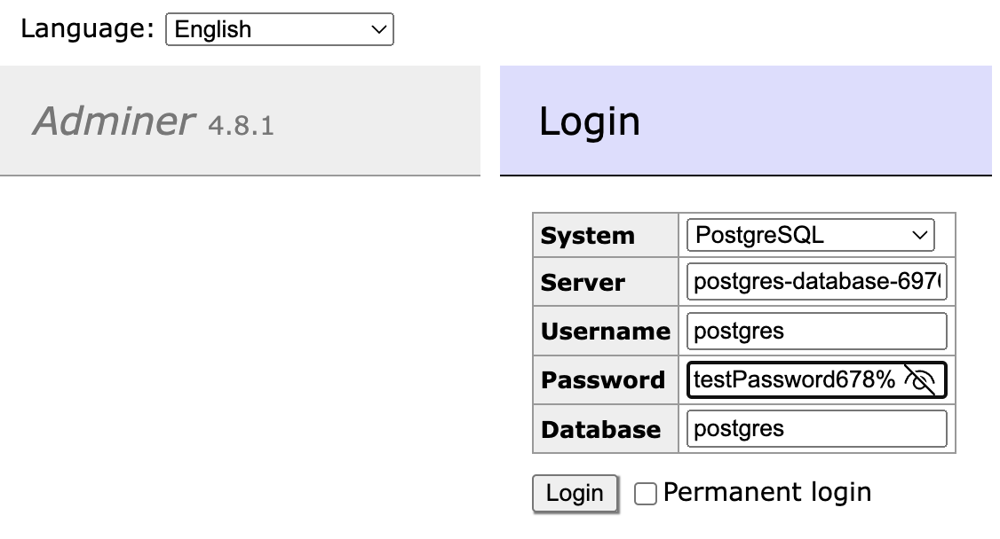

## 17: Deployment Strategies (CKAD Topic)
The four most common deployment strategies are rolling, blue/green, canary, and recreate. Rolling updates involve deploying new Pods in a batch while decreasing old Pods at the same rate. This is the default behavior in Kubernetes. Blue/green deployments provision an entirely new environment (green) parallel to the existing one (blue), then perform a Service selector cutover when approved for production release. Canary deployments allow developers to test a new deployment with a subset of users in parallel with the current production release. Recreating an environment involves destroying the old environment and then provisioning a new one, which may result in downtime.

For a blue/green release, let's start by creating the blue and green deployments. The following YAML for the blue deployment is nearly identical to the green. The only difference is the Docker image used.

```yaml title='17-deployment-strategies/blue-green-deployment/blue.deployment.yaml'
apiVersion: apps/v1
kind: Deployment
metadata:
  name: blue-deployment
spec:
  replicas: 2
  selector:
    matchLabels:
      app: nginx
      role: blue
  template:
    metadata:
      labels:
        app: nginx
        role: blue
    spec:
      # the green deployment uses the green Docker image
      containers:
      - name: blue
        image: scottenriquez/blue-nginx-app
        imagePullPolicy: Always
        ports:
        - containerPort: 80
        resources:
          limits:
            memory: "128Mi"
            cpu: "200m"
```

By default, the production Service should point to the blue environment.

```yaml title='17-deployment-strategies/blue-green-deployment/production.service.yaml'
kind: Service
apiVersion: v1
metadata:
  name: production-service
  labels:
    env: production
spec:
  type: ClusterIP
  selector:
    app: nginx
  ports:
    - port: 9000
      targetPort: 80
```

To perform the release, change the selector on the Production service. Then verify that the web application contains the green release instead of the blue.

```shell title='17-deployment-strategies/blue-green-deployment/commands.sh'
# perform cutover
# can also be done via manifest
kubectl set selector service production-service 'role=green'
# entering BusyBox container shell
kubectl run -it --rm --restart=Never busybox --image=busybox sh
# verify green in HTML
wget production-service:9000
cat index.html
```

Switching gears to a canary release, we start by creating stable and canary Deployments. In this code example, the two web applications are nearly identical, except that the canary has a yellow message in a `<h1>` tag. We control the percentage of canary Pods by splitting the number of canary and stable replicas. For this example, there is a 20% chance of using a canary Pod because there is one canary replica and four stable replicas.

```yaml title='17-deployment-strategies/canary-deployment/canary.deployment.yaml'
apiVersion: apps/v1
kind: Deployment
metadata:
  name: canary-deployment
spec:
  # the stable Deployment has four replicas
  replicas: 1
  selector:
    matchLabels:
      track: canary
  template:
    metadata:
      labels:
        app: nginx
        track: canary
    spec:
      # the stable deployment uses the stable Docker image
      containers:
      - name: canary-deployment
        image: scottenriquez/canary-nginx-app
        imagePullPolicy: Always
        ports:
        - containerPort: 80
        resources:
          limits:
            memory: "128Mi"
            cpu: "200m"
```

With this approach, traffic will be directed to the canary pod on average 20% of the time. It may take several requests to the Service, but a canary webpage will eventually be returned.

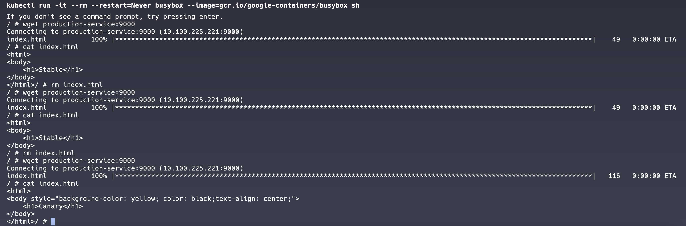

## 18: Probes (CKAD Topic)
There are two primary types of probes: [readiness and liveness](https://kubernetes.io/docs/tasks/configure-pod-container/configure-liveness-readiness-startup-probes/). Kubernetes uses liveness probes to determine when to restart a container (i.e., a health check). It uses readiness probes to determine when a container is ready to accept traffic. These two probes are independent and unaware of each other. Probes of type HTTP, TCP, gRPC, and shell commands are supported. For this example, we'll use HTTP for both and add them as endpoints to an API:

```python title='18-probes-and-health-checks/api-cdk/container/app/main.py'
@api.get('/api/healthy')
def config():
    return {
        'healthy': True
    }

@api.get('/api/ready')
def config():
    return {
        'ready': True
    }
```

In the Deployment manifest, we simply map the probes to the endpoints:

```yaml title='18-probes-and-health-checks/deployment.yaml
apiVersion: apps/v1
kind: Deployment
metadata:
  name: probe-api-deployment
spec:
  replicas: 1
  selector:
    matchLabels:
      name: probe-api
  template:
    metadata:
      labels:
        name: probe-api
    spec:
      containers:
        - name: probe-api-container
          # deployed via CDK
          # replace with your image
          image: 196736724465.dkr.ecr.us-west-2.amazonaws.com/cdk-hnb659fds-container-assets-196736724465-us-west-2:86b591781a296c7b2980608eeb67e30aaf316c732c92b6a47e536555bce0dc93 
          ports:
            - containerPort: 8000
          resources:
            limits:
              cpu: 250m
              memory: 256Mi
          livenessProbe:
            httpGet:
              path: /api/healthy
              port: 8000
          readinessProbe:
            httpGet:
              path: /api/ready
              port: 8000
```

## 19: SecurityContext (CKAD Topic)
A [SecurityContext](https://kubernetes.io/docs/tasks/configure-pod-container/security-context/) resource configures a Pod's privilege and access control settings, such as enabling or disabling Linux capabilities and running as a specific user ID. This topic is straightforward but critical for the exam.

```yaml title='19-security-context/pod.yaml'
apiVersion: v1
kind: Pod
metadata:
  name: security-context-pod
spec:
  securityContext:
    runAsUser: 1000
    runAsGroup: 3000
    fsGroup: 2000
  volumes:
  - name: security-context-pod-volume
    emptyDir: {}
  containers:
  - name: security-context-container
    image: busybox:1.28
    command: [ "sh", "-c", "id" ]
    volumeMounts:
    - name: security-context-pod-volume
      mountPath: /data/security-context-volume
    securityContext:
      allowPrivilegeEscalation: false
```

## 20: ServiceAccounts and Role-Based Access Control (CKAD Topic)
Like how Identity and Access Management (IAM) in AWS grants principals permissions to specific actions for specific resources, Kubernetes [Roles](https://kubernetes.io/docs/reference/access-authn-authz/rbac/) and [ServiceAccounts](https://kubernetes.io/docs/concepts/security/service-accounts/) allow resources within the cluster to leverage the control plane to perform operations on the cluster. For this example, let's grant a Pod access to `get` other Pods. We start by creating a Role:

```yaml title='20-service-accounts-and-rbac/role.yaml'
apiVersion: rbac.authorization.k8s.io/v1
kind: Role
metadata:
  namespace: default
  name: pod-reader
rules:
# "" indicates the core API group
- apiGroups: [""]
  resources: ["pods"]
  verbs: ["get", "watch", "list"]
```

A ServiceAccount provides an identity for processes that run inside Pods. We generate one next:

```yaml title='20-service-accounts-and-rbac/service-account.yaml'
apiVersion: v1
kind: ServiceAccount
metadata:
  annotations:
    kubernetes.io/enforce-mountable-secrets: "true"
  name: sa-pod-reader
```

Next, we bind the Role to the ServiceAccount:

```yaml title='20-service-accounts-and-rbac/role-binding.yaml'
apiVersion: rbac.authorization.k8s.io/v1
kind: RoleBinding
metadata:
  name: read-pods
  namespace: default
subjects:
- kind: ServiceAccount 
  name: sa-pod-reader 
  apiGroup: ""
roleRef:
  kind: Role
  name: pod-reader 
  apiGroup: "" 
```

Then, we create a Pod that leverages the ServiceAccount:

```yaml title='20-service-accounts-and-rbac/pod.yaml'
apiVersion: v1
kind: Pod
metadata:
  name: reader-pod 
spec:
  serviceAccountName: sa-pod-reader
  containers:
    - name: reader-container
      image: alpine:3.12
      resources:
        limits:
          memory: "128Mi"
          cpu: "500m"
      command: ["/bin/sh"]
      args: ["-c", "sleep 3600"]
```

Finally, we can test specific operations against the API server to validate that certain actions are allowed and others are denied.

```shell title='20-service-accounts-and-rbac/commands.sh'
# entering Pod shell
kubectl exec -it reader-pod -- sh
# install curl
apk --update add curl
# get Pods
# allowed by Role
curl -s --header "Authorization: Bearer $(cat /var/run/secrets/kubernetes.io/serviceaccount/token)" --cacert /var/run/secrets/kubernetes.io/serviceaccount/ca.crt https://kubernetes/api/v1/namespaces/default/pods
# get Secrets
# denied by Role
curl -s --header "Authorization: Bearer $(cat /var/run/secrets/kubernetes.io/serviceaccount/token)" --cacert /var/run/secrets/kubernetes.io/serviceaccount/ca.crt https://kubernetes/api/v1/namespaces/default/secrets
```

## 21: NetworkPolicy (CKAD Topic)
By default, network traffic between Pods is unrestricted. In other words, any Pod can communicate with any other Pod. A [NetworkPolicy](https://kubernetes.io/docs/concepts/services-networking/network-policies/) is a Kubernetes resource that uses selectors to implement granular ingress and egress rules. However, a [network plugin](https://kubernetes.io/docs/concepts/extend-kubernetes/compute-storage-net/network-plugins/) must first be installed in the cluster to leverage NetworkPolicies. For this example, we will use [Calico](https://docs.tigera.io/calico/latest/about/). For EKS, this only requires two commands:
```shell title='21-network-policy/commands.sh'
kubectl create -f https://raw.githubusercontent.com/projectcalico/calico/v3.28.1/manifests/tigera-operator.yaml
kubectl create -f - <<EOF
kind: Installation
apiVersion: operator.tigera.io/v1
metadata:
  name: default
spec:
  kubernetesProvider: EKS
  cni:
    type: AmazonVPC
  calicoNetwork:
    bgp: Disabled
EOF
```

With the network plugin installed, we can define a simple NetworkPolicy based on three example Pods:

```yaml title='21-network-policy/network-policy.yaml'
apiVersion: networking.k8s.io/v1
kind: NetworkPolicy
metadata:
  name: pod-one-and-two-network-policy
spec:
  podSelector:
    matchLabels:
      # this label is also attached to the first two Pods but not the third
      network: allow-pod-one-and-two 
  policyTypes:
  - Ingress
  - Egress
  ingress:
  - from:
    - podSelector:
        matchLabels:
          network: allow-pod-one-and-two 
  egress:
  - to:
    - podSelector:
        matchLabels:
          network: allow-pod-one-and-two 
```

After applying the manifest above, we can validate that the network traffic now behaves as expected (i.e., the first two Pods can communicate with each other without allowing traffic from the third).

```shell title='21-network-policy/commands.sh'
# get Pod IP addresses
kubectl get pods -o wide
# enter pod-three shell
kubectl exec -it pod-three -- sh
# ping pod-one and pod-two IP address (replace with yours)
# these commands should hang
ping 192.168.2.246
ping 192.168.21.2
# returning to default shell
exit
# enter pod-one shell
kubectl exec -it pod-one -- sh
# ping pod-two IP address (replace with yours)
# this command should be successful
ping 192.168.21.2
# ping pod-three IP address (replace with yours)
# this command should hang
ping 192.168.71.123
```

## 22: ArgoCD

ArgoCD is a declarative continuous delivery tool for Kubernetes that leverages the GitOps pattern (i.e., storing configuration files in a Git repository to serve as the single source of truth). Instead of developers constantly typing `kubectl apply -f manifest.yaml`, ArgoCD monitors a specified Git repository for changes to manifests. ArgoCD applications can be configured to automatically update when deltas are detected or require manual intervention. Applications can be created using a GUI or through a YAML file. To get started, we install ArgoCD on the cluster and configure port forwarding to access the UI locally.

```shell title='22-argocd/commands.sh'
# install CLI
brew install argocd
# install ArgoCD on the cluster
kubectl create namespace argocd
kubectl apply -n argocd -f https://raw.githubusercontent.com/argoproj/argo-cd/stable/manifests/install.yaml
# get initial password
argocd admin initial-password -n argocd
# forward ports to access the ArgoCD UI locally
kubectl port-forward svc/argocd-server -n argocd 8080:443
```

Once we've navigated to the UI in the browser, we create an ArgoCD application using the following YAML:

```yaml title='22-argocd/argocd-application.yaml'
apiVersion: argoproj.io/v1alpha1
kind: Application
metadata:
  name: helm-webapp-dev
spec:
  destination:
    name: ''
    namespace: default
    server: https://kubernetes.default.svc
  source:
    path: helm-webapp
    # all credit to devopsjourney1 for the repository
    # https://github.com/devopsjourney1
    # https://www.youtube.com/@DevOpsJourney
    repoURL: https://github.com/scottenriquez/argocd-examples
    targetRevision: HEAD
    helm:
      valueFiles:
        - values-dev.yaml
  sources: []
  project: default
  syncPolicy:
    automated:
      prune: false
      selfHeal: false
```

Based on the configuration, the ArgoCD application will automatically be updated when we commit to the specified GitHub repository. Via the UI, we can monitor the resources that have been created, sync status, commit information, etc.

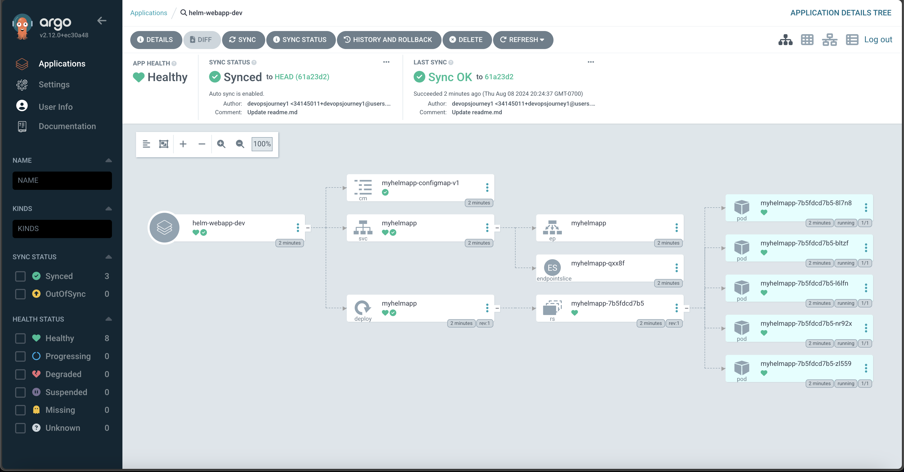

## 23: cdk8s
The AWS Cloud Development Kit (CDK) is an open-source software development framework that brings the capabilities of general-purpose programming languages (e.g., unit testing, adding robust logic, etc.) to infrastructure as code. In addition to being more ergonomic for those with a software engineering background, CDK also provides higher levels of abstraction through [constructs](https://docs.aws.amazon.com/cdk/v2/guide/constructs.html) and [patterns](https://cdkpatterns.com/). HashiCorp also created a spinoff called [CDK for Terraform](https://developer.hashicorp.com/terraform/cdktf) (CDKTF). Using a similar design, AWS created a project called [Cloud Development Kit for Kubernetes](https://cdk8s.io/) (cdk8s). Rather than managing the cloud infrastructure, cdk8s only manages the resources within a Kubernetes cluster. The code compiles the TypeScript (or language of your choice) to a YAML manifest file. Below is an example:

```typescript title='23-cdk8s/cluster/main.ts'
export class MyChart extends Chart {
  constructor(scope: Construct, id: string, props: ChartProps = { }) {
    super(scope, id, props);
    new KubeDeployment(this, 'my-deployment', {
      spec: {
        replicas: 3,
        selector: { matchLabels: { app: 'frontend' } },
        template: {
          metadata: { labels: { app: 'frontend'} },
          spec: {
            containers: [
              {
                name: 'app-container',
                image: 'nginx:latest',
                ports: [{ containerPort: 80 }]
              }
            ]
          }
        }
      }
    });
  }
}
```

```yaml
apiVersion: apps/v1
kind: Deployment
metadata:
  name: cluster-my-deployment-c8e7fb18
spec:
  replicas: 3
  selector:
    matchLabels:
      app: frontend
  template:
    metadata:
      labels:
        app: frontend
    spec:
      containers:
        - image: nginx:latest
          name: app-container
          ports:
            - containerPort: 80
```

## 24: OpenFaaS
[OpenFaaS](https://www.openfaas.com/) is a nifty project that allows you to run serverless functions on Kubernetes. We start by installing OpenFaaS to our cluster and as a CLI:

```shell title='24-openfaas/commands.sh'
# install CLI on local machine
# https://docs.openfaas.com/cli/install/
brew install faas-cli
# create namespace
kubectl apply -f namespace.yaml
# add Helm charts to cluster
helm repo add openfaas https://openfaas.github.io/faas-netes
helm install my-openfaas openfaas/openfaas --version 14.2.49 --namespace openfaas
# forward the API's port in a separate terminal tab
kubectl port-forward svc/gateway 8080 --namespace openfaas
# fetch password and log in
faas-cli login --password $(kubectl -n openfaas get secret basic-auth -o jsonpath="{.data.basic-auth-password}" | base64 --decode)
```

Next, we create a simple function that looks similar to AWS Lambda:

```shell title='24-openfaas/commands.sh'
# create a function
faas-cli new --lang python openfaas-python-function
# requires Docker running locally
faas-cli build -f openfaas-python-function.yml
# push to DockerHub
faas-cli publish -f openfaas-python-function.yml
# deploy to cluster
faas-cli deploy -f openfaas-python-function.yml
```

```python title='24-openfaas/openfaas-python-function/handler.py'
def handle(request):
    return "Hello from OpenFaaS!"
```

Finally, we can invoke the function through the web UI:

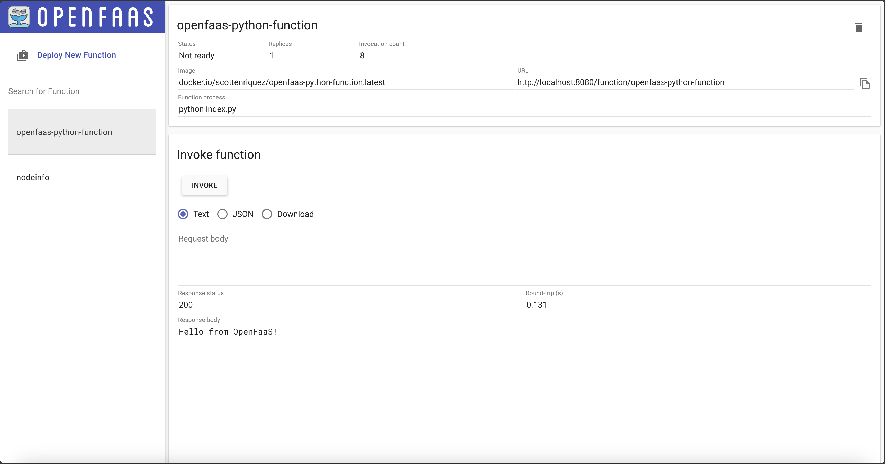

## Disclaimer
At the time of writing this blog post, I currently work for Amazon Web Services. The opinions and views expressed here are my own and not the views of my employer.